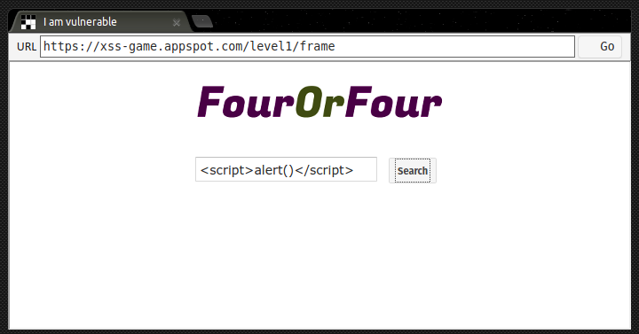
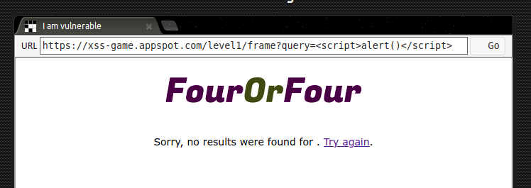
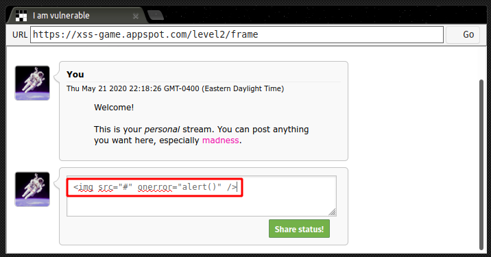
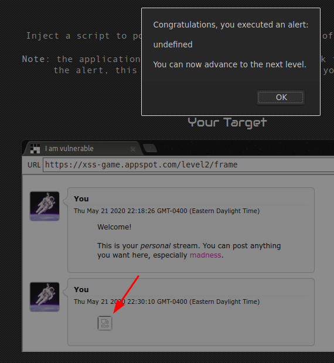
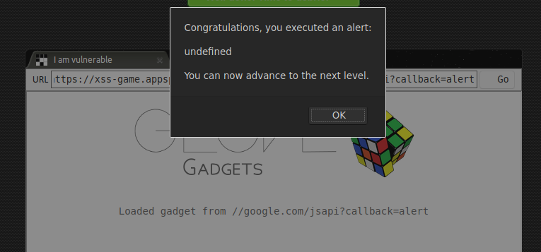

+++
title = "XSS Game Area"
date = "2020-05-21"
author = "vsvn"
draft = false
cover = ""
tags = ["xss", "cyber"]
keywords = ["cyber", "xss", "infosec", "cybersecurity"]
description = "A fun introduction to XSS"
showFullContent = false
+++

In my continued quest to learn all I can in the world of bug bounty, I stumbled across the [XSS Game](https://xss-game.appspot.com) from Google. It has six levels of differing XSS bugs, starting from the most generic direct DOM injection through a form of and insecure source injection. And apparently there's cake if you make it to the end!

So lets get right into it!

# Level 1: Hello, world of XSS

This one is super straightforward, just slap a `` into the search engine box.

I didn't open the source for this one until I started this writeup, but this works because it's a direct injection of the `query` request parameter into the file on the result page:

# Level 2: Persistence is Key

This one wasn't too bad either, it's more of a stored XSS vulnerability. It's a social media site with totally unfiltered input. There are a bunch of ways that this could be exploited, though my first attempt of a simple `` didn't work out.

So, we turn to an invalid image tag:

**Payload**: ``:

 
worked like a charm! You can see my broken image in the background with the congratulations alert:

This works because it attempts to load an image located at the invalid path of "#", which will link to the HTML page itself (obviously not a valid image), and then fires the `onerror` handler.

# Level 3: That sinking feeling...

This level makes use of some dynamic content loading. Obviously, it was intended to be used for images...but we're not here for kittens. After looking at the source and some of the hints, I settled on line 17:

`html += "";`

There is no content validation on this parameter, so to break this you simply close out the single tick `'` opened in the `">` link at the bottom of the page, which we injected with our super sneaky `javascript:alert()` functionality.

# Level 6: Follow the 🐇

This is the one that I was entirely lost on. Following the same writeup as before, I actually learned that writeup that if no protocol is supplied then it will be implied from the current page. This gets around the regex filter of disallowing all links with `http` or `https` at the start.

From there, he made use of Google's own [minified JavaScript API file](https://google.com/jsapi) and set the callback as alert:

**Payload**: `//google.com/jsapi?callback=alert`

I really liked this one because I learned two new things, the protocol being carried over and about Google's jsapi file, which was super clever.

# Conclusion

And with that... I was done!

I'm still definitely a beginner in the world of web app bug hunting, but it's exciting to learn some new stuff! I try to live by the idea of doing something every day to make myself better tomorrow, and this was it for today. I didn't have as much time as I would have liked and wasn't able to take on a Hacker101 CTF level like I have been, but this was good introduction to some new XSS techniques (even if half of them are *extremely* unlikely to actually show up in a real product).

It also gave me an opportunity to actually write something about what I'm doing for once, which I'm excited about! And finally... the cake was not, in fact, a lie:

